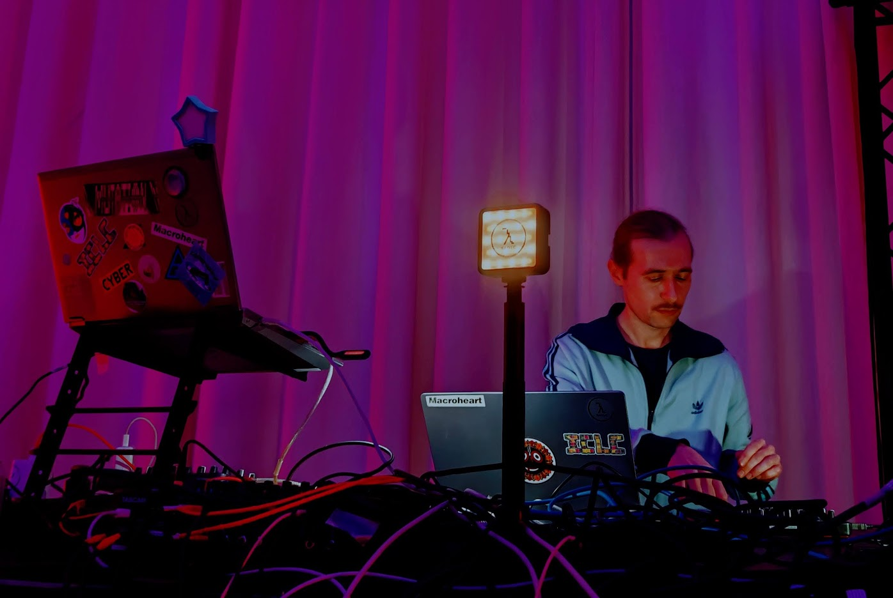
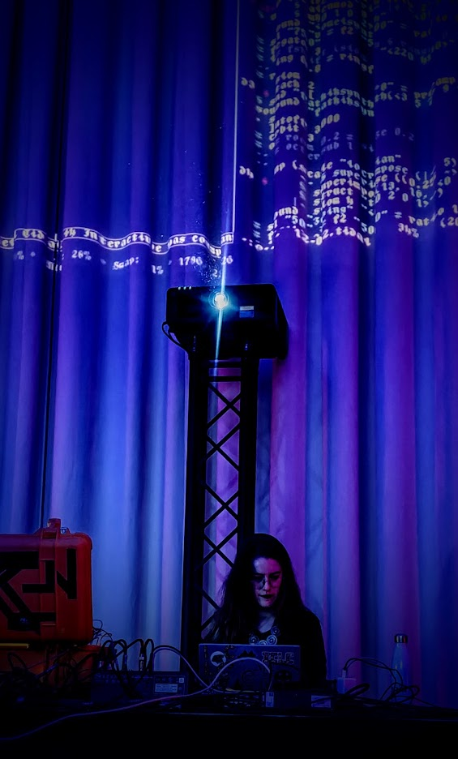
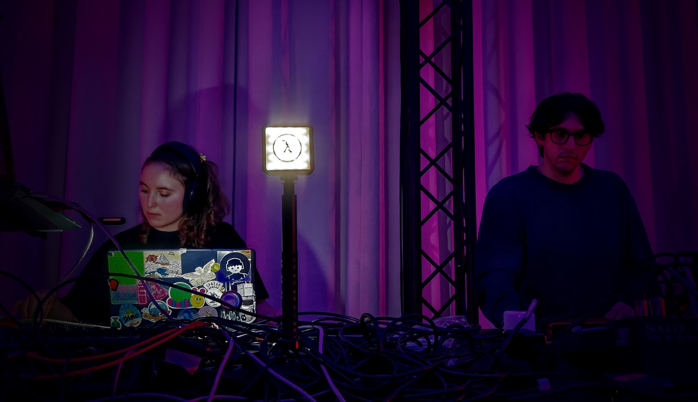
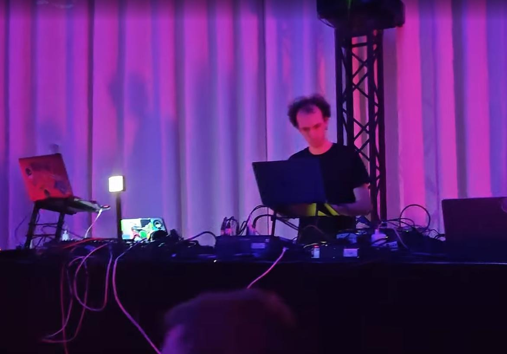
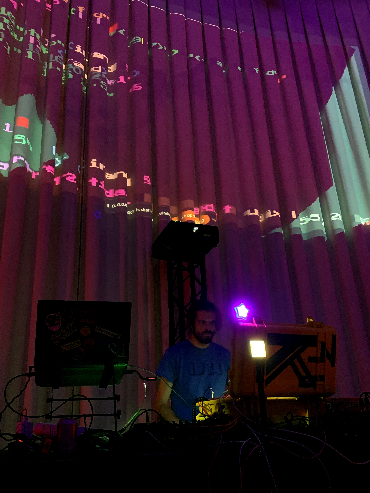
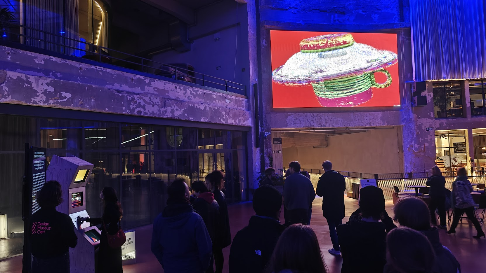

Title: Museumnacht 
Date: 2025-12-04
Category: events
Slug: Museumnacht2025
Template: event
Tags: algorave, livecoding
Image: 20251204_museumnacht2025.jpg
Summary: 

# livecoding as painting on the wall

We were (just like last year) asked to do the museumnight music program in the Wintercircus for the Designmuseum (closed for renovation)

