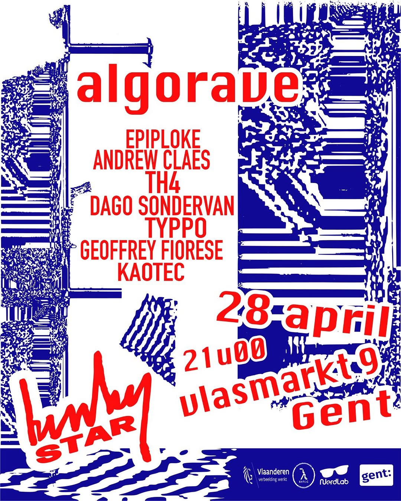

Title: algorave Kinky Star + Workshop
Date: 2026-04-28
Category: events
Slug: kinky2026
Template: event
Tags:  visuals, algorave, livecoding, kaotec
Summary: A short strudel intro workshop, by masters in the craft with a rave at the end
image: 20260428_kinkystar.jpg
imgcap: Algorave (workshop+livecode) time!

Vette visuals en dikke beats! Tijd om de benen nog eens hard te laten gaan op een Algo Rave. @nerdlab9000 , @muziekcentrumkinkystar , @lambdasonic , @opendexdj en @personmakes organiseren samen een Algorave op 28 april in de Kinky Star. Meer info op nerdlab.be of linkje in onze bio. Tot daaaaan!

Also, same event:

Samen met @nerdlab9000 @muziekcentrumkinkystar @personmakes @opendexdj organiseren we een workshop live coderen met niemand minder dan Alex McLean en Lucy Cheesman.

Tijdens deze korte sessie (18u–19u30) krijg je een crash course in TidalCycles via Strudel, een browsergebaseerde omgeving.

Of je nu al ervaring hebt of nog helemaal nieuw bent, iedereen is welkom! Er is geen voorkennis nodig, enkel goesting om te experimenteren.

Inschrijven is aangeraden om je plaats te garanderen. link in bio of via nerdlab.be.

thanks [oznroll](../../coders/oz.n.roll/) for the poster!