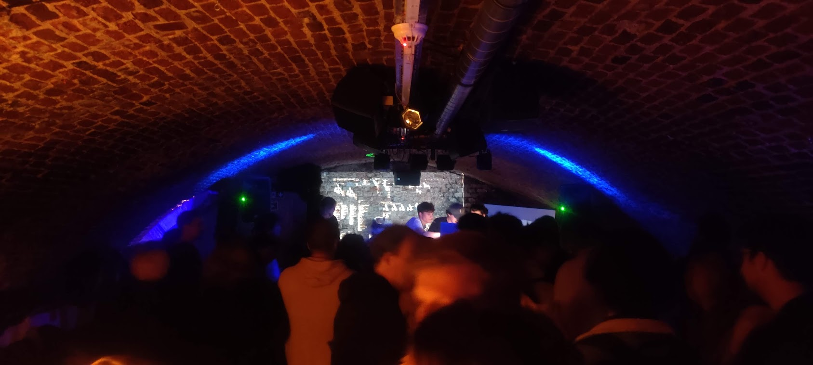

Title: algorave De Roes Gent
Date: 2023-05-25
Category: events
Slug: roesgent
Template: event
Tags: , kaotec, sondervan, geoffreyfiorese, typpo, ozn_roll, timohoogland, nerdlab
Summary: To conclude the livecoding class at Broei, we had an underground algorave at De Roes with the students, some lambdasonic artists and a guest from the Netherlands
image: 20230525_roes.jpg
imgcap: going nuts with livecoding and synths

Lambdasonic was invited to conclude a modular BYOS fest in an old clothing store in Halle, near Brussels. 

We introduced the modular synth community to some livecoding. 

<iframe width="100%" height="300px" src="https://www.youtube.com/embed/R-HXQy1ZOxE?si=3230gcnKMRNNaUv8" title="YouTube video player" frameborder="0" allow="accelerometer; autoplay; clipboard-write; encrypted-media; gyroscope; picture-in-picture; web-share" allowfullscreen></iframe>

